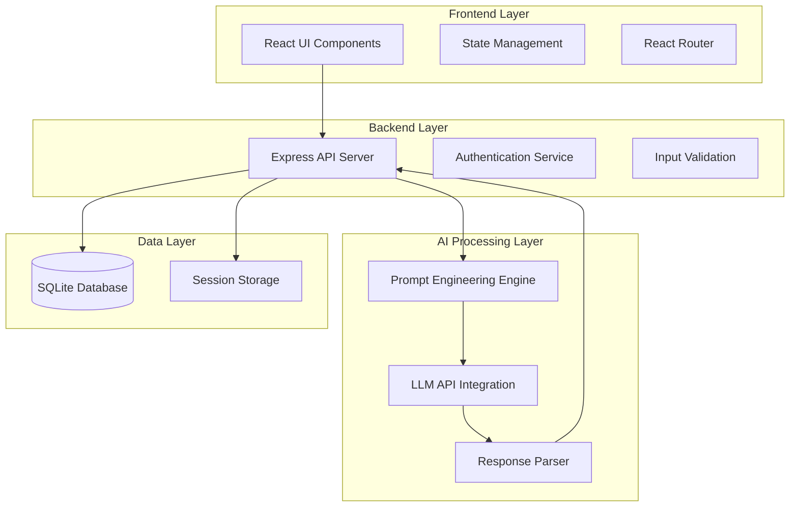

# Design Document: Explain My Mistake

## Overview

Explain My Mistake is an AI that understands how students think when they're wrong—and teaches from that. Unlike traditional AI tutors that answer questions, this system analyzes thinking errors and transforms them into personalized learning moments for CS & Engineering students.

The architecture follows a demo-optimized design with a React frontend, Node.js/Express backend, and LLM-powered analysis engine. The system emphasizes the mistake-first learning philosophy through visible Answer-Safe Mode, Mistake Fingerprints, and Socratic questioning methods.

## Architecture

### High-Level Architecture



### System Components

**Frontend (React/Next.js)**
- Question submission interface optimized for CS/Engineering problems (primary) with multi-domain support
- Visible "Answer-Safe Mode: ON" indicator with tooltip explanation
- Mistake Fingerprint visualization using tags and simple charts
- Tone selector component for communication preferences
- Streamlined demo flow: one mistake → one insight

**Backend (Node.js/Express)**
- RESTful API endpoints focused on core analysis workflow
- Mistake pattern recognition for fingerprint generation
- Socratic question generation engine
- Minimal authentication for demo purposes

**AI Processing Engine**
- CS/Engineering-focused prompt templates with domain adaptation
- Answer-revelation prevention as first-class constraint
- Socratic questioning integration in all responses
- Mistake fingerprint pattern analysis

**Data Storage (SQLite)**
- Simplified schema focused on mistake patterns and fingerprints
- User profiles with learning pattern tracking
- Session data for demo continuity

## Components and Interfaces

### Core Components

#### 1. Question Analyzer
**Purpose**: Processes student submissions and coordinates AI analysis

**Interface**:
```typescript
interface QuestionAnalyzer {
  analyzeSubmission(question: string, attemptedAnswer: string, subject: SubjectDomain): Promise<AnalysisResult>
  validateInput(input: StudentSubmission): ValidationResult
  determineComplexity(question: string): ComplexityLevel
}

interface AnalysisResult {
  errorDiagnosis: ErrorDiagnosis
  conceptGaps: ConceptGap[]
  correctedReasoning: ReasoningGuidance
  practiceQuestion: PracticeQuestion
  confidence: number
}
```

#### 2. Prompt Engineering Engine
**Purpose**: Generates structured prompts for LLM interactions based on educational best practices

**Interface**:
```typescript
interface PromptEngine {
  buildAnalysisPrompt(submission: StudentSubmission, toneMode: ToneMode): StructuredPrompt
  buildPracticePrompt(conceptGap: ConceptGap, difficulty: number): StructuredPrompt
  validatePromptSafety(prompt: string): SafetyResult
}

interface StructuredPrompt {
  systemRole: string
  taskDescription: string
  constraints: string[]
  outputFormat: string
  examples: PromptExample[]
}
```

#### 3. Mistake Fingerprint Tracker
**Purpose**: Generates and maintains personalized learning pattern profiles

**Interface**:
```typescript
interface MistakeFingerprintTracker {
  generateFingerprint(userId: string): Promise<MistakeFingerprint>
  updateFingerprint(userId: string, newMistake: MistakeRecord): Promise<void>
  getCommonErrorTypes(userId: string): Promise<ErrorType[]>
  getImprovementTrend(userId: string): Promise<ImprovementTrend>
}

interface MistakeFingerprint {
  userId: string
  commonErrorTypes: ErrorType[]
  recurringConcepts: string[]
  improvementTrend: ImprovementTrend
  visualTags: string[]
  lastUpdated: Date
}
```

#### 4. Socratic Question Generator
**Purpose**: Creates reflective questions that encourage deeper thinking

**Interface**:
```typescript
interface SocraticQuestionGenerator {
  generateQuestion(errorType: ErrorType, concept: string): Promise<string>
  validateQuestionQuality(question: string): Promise<boolean>
  ensureNoAnswerRevelation(question: string, correctAnswer: string): Promise<boolean>
}
```

#### 5. Response Formatter
**Purpose**: Structures AI responses with Answer-Safe Mode and Socratic elements

**Interface**:
```typescript
interface ResponseFormatter {
  formatEducationalResponse(rawResponse: string, toneMode: ToneMode): FormattedResponse
  addSocraticQuestion(response: FormattedResponse, errorContext: ErrorContext): FormattedResponse
  ensureAnswerSafeMode(response: string): ValidationResult
  addAnswerSafeBadge(response: FormattedResponse): FormattedResponse
}

interface FormattedResponse {
  errorDiagnosis: string
  conceptExplanation: string
  reasoningGuidance: string[]
  proofOfLearning: string
  socraticQuestion: string
  answerSafeBadge: boolean
  encouragement: string
  learningMetrics?: LearningMetrics
}
```

## Data Models

### Core Data Structures

#### Student Submission
```typescript
interface StudentSubmission {
  id: string
  userId: string
  question: string
  attemptedAnswer: string
  subject: SubjectDomain
  submissionTime: Date
  tonePreference: ToneMode
}

enum SubjectDomain {
  CODING = 'coding',           // Primary focus - CS & Engineering
  DATA_STRUCTURES = 'dsa',     // Primary focus - CS & Engineering  
  ALGORITHMS = 'algorithms',   // Primary focus - CS & Engineering
  MATHEMATICS = 'mathematics', // Secondary support
  THEORY = 'theory',          // Secondary support
  MULTIPLE_CHOICE = 'mcq'     // Secondary support
}

enum ToneMode {
  GENTLE = 'gentle',
  EXAM_ORIENTED = 'exam-oriented', 
  STRICT_MENTOR = 'strict-mentor'
}
```

#### Analysis Results
```typescript
interface ErrorDiagnosis {
  primaryError: string
  secondaryErrors: string[]
  errorCategory: ErrorCategory
  severity: ErrorSeverity
}

interface ConceptGap {
  concept: string
  description: string
  importance: ImportanceLevel
  prerequisites: string[]
  resources: LearningResource[]
}

interface ReasoningGuidance {
  steps: ReasoningStep[]
  keyInsights: string[]
  commonPitfalls: string[]
  nextActions: string[]
}

interface PracticeQuestion {
  question: string
  difficulty: DifficultyLevel
  targetConcepts: string[]
  hints: string[]
  timeEstimate: number
  isProofOfLearning: boolean
}
```

#### User Progress and Mistake Fingerprint
```typescript
interface UserProfile {
  id: string
  email: string
  createdAt: Date
  preferences: UserPreferences
  mistakeFingerprint: MistakeFingerprint
  demoMode: boolean
}

interface MistakeFingerprint {
  userId: string
  commonErrorTypes: ErrorType[]
  recurringConcepts: string[]
  improvementTrend: ImprovementTrend
  visualTags: string[]
  strengthAreas: string[]
  learningMetrics: LearningMetrics
  lastUpdated: Date
}

interface LearningMetrics {
  conceptResolvedAfterAttempts: Map<string, number>
  mistakeRecurrenceRate: number
  improvementVelocity: number
  masteryIndicators: string[]
}

interface MistakeRecord {
  questionId: string
  subject: SubjectDomain
  conceptsInvolved: string[]
  errorType: ErrorType
  timestamp: Date
  resolved: boolean
  socraticResponse: string
}
```

Now I need to use the prework tool to analyze the acceptance criteria before writing the Correctness Properties section:

<function_calls>
<invoke name="prework">
<parameter name="featureName">explain-my-mistake

## Correctness Properties

*A property is a characteristic or behavior that should hold true across all valid executions of a system—essentially, a formal statement about what the system should do. Properties serve as the bridge between human-readable specifications and machine-verifiable correctness guarantees.*

Based on the requirements analysis, the following properties ensure the system maintains educational integrity and effectiveness:

### Property 1: Error Analysis Completeness
*For any* student submission containing errors, the system should identify at least one specific error and provide analysis without revealing the correct final answer.
**Validates: Requirements 1.1, 1.2**

### Property 2: Fundamental Error Prioritization  
*For any* submission with multiple errors, the system should address the most fundamental conceptual error first in its explanation.
**Validates: Requirements 1.3**

### Property 3: Balanced Feedback for Partial Correctness
*For any* partially correct submission, the system response should acknowledge correct portions while focusing primary attention on erroneous parts.
**Validates: Requirements 1.4**

### Property 4: Multi-Domain Analysis Support
*For any* valid question from coding, mathematics, theory, or multiple-choice domains, the system should successfully generate domain-appropriate analysis.
**Validates: Requirements 1.5, 5.1, 5.2, 5.3, 5.4**

### Property 5: Concept Gap Identification and Explanation
*For any* incorrect answer with identifiable concept gaps, the system should identify relevant gaps and explain them with clear connections to the specific errors made.
**Validates: Requirements 2.1, 2.2, 2.4**

### Property 6: Educational Context Provision
*For any* identified concept gap, the system should provide context about why the concept is important for solving similar problems.
**Validates: Requirements 2.5**

### Property 7: Concept Gap Prioritization
*For any* submission involving multiple concept gaps, the system should distinguish between primary and secondary gaps in its explanation.
**Validates: Requirements 2.3**

### Property 8: Guided Reasoning Without Answer Revelation
*For any* corrected reasoning guidance, the system should provide educational steps that build understanding without revealing final answers or making them trivially obvious.
**Validates: Requirements 3.1, 3.5**

### Property 9: Personalized Reasoning Guidance
*For any* student submission, the corrected reasoning should reference and build upon the student's original work as a starting point.
**Validates: Requirements 3.2**

### Property 10: Educational Approach Optimization
*For any* problem with multiple valid solution approaches, the system should focus on the approach most educational for the identified concept gaps.
**Validates: Requirements 3.3**

### Property 11: Student Empowerment Encouragement
*For any* reasoning guidance provided, the system should encourage the student to apply the corrected reasoning to reach their own conclusion.
**Validates: Requirements 3.4**

### Property 12: Relevant Practice Question Generation
*For any* analyzed mistake, the system should generate practice questions that target the same concepts while being similar in difficulty but different in specific details.
**Validates: Requirements 4.1, 4.2**

### Property 13: Practice Question Applicability
*For any* generated practice question, the corrected reasoning provided should be applicable to solving that practice question.
**Validates: Requirements 4.3**

### Property 14: Practice Question Variation
*For any* concept requiring additional practice, the system should generate multiple varied questions targeting the same concept when requested.
**Validates: Requirements 4.4**

### Property 15: Diagnostic Practice Questions
*For any* practice question generated, it should be designed to reveal whether the student has internalized the corrected understanding.
**Validates: Requirements 4.5**

### Property 16: Domain-Adaptive Communication
*For any* subject domain switch, the system should adapt its explanation style to match domain-specific conventions and terminology.
**Validates: Requirements 5.5**

### Property 17: Tone Mode Consistency
*For any* selected tone mode (gentle, exam-oriented, or strict mentor), the system should maintain that communication style consistently throughout the interaction.
**Validates: Requirements 6.1, 6.2, 6.3, 6.4**

### Property 18: Tone Mode Flexibility
*For any* user session, the system should allow tone mode changes between different questions or sessions.
**Validates: Requirements 6.5**

### Property 19: Learning History Persistence
*For any* student submission, the system should store the question, attempted answer, and identified concept gaps in the student's learning history.
**Validates: Requirements 7.1**

### Property 20: Progress Pattern Recognition
*For any* student with submission history, the system should identify and display patterns in mistake types and learning improvement over time.
**Validates: Requirements 7.2, 7.4**

### Property 21: Recurring Gap Highlighting
*For any* student with recurring concept gaps, the system should highlight these areas as needing additional focus.
**Validates: Requirements 7.3**

### Property 22: Historical Context Integration
*For any* student revisiting a previously problematic concept, the system should reference their history to provide contextual encouragement.
**Validates: Requirements 7.5**

### Property 23: Pedagogically Sound Response Structure
*For any* system response, it should be structured with clear sections for error diagnosis, concept explanation, and reasoning guidance, while being complete enough to be educational but concise enough to maintain engagement.
**Validates: Requirements 8.1, 8.3, 8.4**

### Property 24: Level-Appropriate Communication
*For any* concept explanation, the system should use examples and analogies appropriate to the student's apparent level and provide explanations for technical jargon when necessary.
**Validates: Requirements 8.2, 8.5**

## Error Handling

### Input Validation and Sanitization
- All user inputs undergo validation for format, length, and content appropriateness
- Malicious input detection prevents prompt injection attacks
- Subject domain validation ensures questions match supported categories
- Rate limiting prevents system abuse and ensures fair resource allocation

### LLM Response Validation
- Response parsing validates that AI outputs contain required educational sections
- Content filtering ensures responses don't reveal final answers inappropriately
- Pedagogical constraint checking verifies educational quality standards
- Fallback responses handle cases where AI analysis fails or is incomplete

### System Resilience
- Graceful degradation when LLM services are unavailable
- Database connection failure handling with appropriate user messaging
- Session timeout management with progress preservation
- Error logging and monitoring for system health tracking

### User Experience Error Handling
- Clear error messages for invalid question formats or unsupported subjects
- Guidance for users when submissions cannot be analyzed
- Recovery suggestions when technical issues occur
- Progress preservation during system interruptions

## Testing Strategy

### Dual Testing Approach

The system requires both unit testing and property-based testing for comprehensive validation:

**Unit Tests** focus on:
- Specific examples of error analysis for known mistake types
- Edge cases like empty submissions or malformed questions
- Integration points between components (API endpoints, database operations)
- Error conditions and system resilience scenarios

**Property-Based Tests** focus on:
- Universal properties that hold across all valid inputs
- Comprehensive input coverage through randomized test generation
- Educational constraint validation across diverse scenarios
- Cross-domain functionality verification

### Property-Based Testing Configuration

**Framework Selection**: Use `fast-check` for JavaScript/TypeScript property-based testing
**Test Configuration**: Minimum 100 iterations per property test to ensure statistical confidence
**Test Tagging**: Each property test references its design document property with format:
`Feature: explain-my-mistake, Property {number}: {property_text}`

### Testing Implementation Strategy

**Educational Response Validation**:
- Generate diverse question-answer pairs across all supported domains
- Verify response structure, educational constraints, and pedagogical quality
- Test tone consistency across different communication modes
- Validate that final answers are never revealed inappropriately

**Learning Progress Testing**:
- Create synthetic user histories with various mistake patterns
- Verify progress tracking accuracy and pattern recognition
- Test recommendation algorithms for recurring concept gaps
- Validate historical context integration in responses

**Cross-Domain Functionality**:
- Test analysis quality across coding, math, theory, and MCQ domains
- Verify domain-specific explanation style adaptation
- Test practice question generation relevance and quality
- Validate concept gap identification accuracy per domain

**System Integration Testing**:
- End-to-end workflow testing from submission to response
- Database persistence and retrieval accuracy
- API endpoint functionality and error handling
- User session management and state preservation